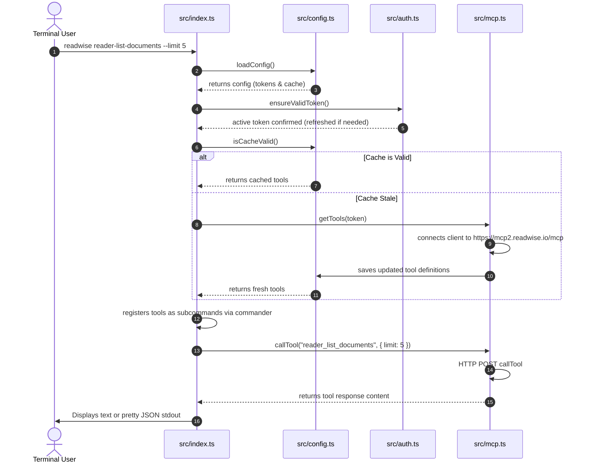
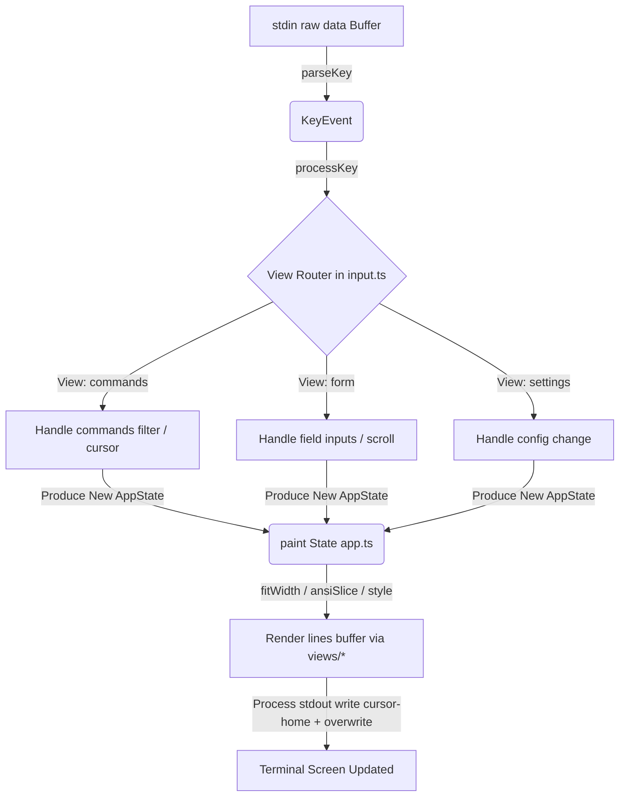

last updated: 2026-05-22

# Readwise CLI — AI Agent System Playbook & Architecture Manual

Welcome! This document serves as the master guide, runtime blueprint, and operational playbook for AI agents (and developers) working on or integrating with the Readwise CLI. It details the system architecture, core execution loops, security controls, and provides an actionable roadmap to make the CLI more secure, performant, private, and maintainable.

---

## 🏗️ System Architecture & Data Flows

The Readwise CLI is a hybrid node application that acts as a client to the **Readwise MCP (Model Context Protocol) Server** (`https://mcp2.readwise.io/mcp`). Instead of hardcoding API endpoints and request/response parsers for every Readwise feature, the CLI dynamically discovers capabilities and translates them into terminal interfaces.

```
                  ┌──────────────────────────────┐
                  │      Readwise CLI (Node)     │
                  └──────────────┬───────────────┘
                                 │
                    [Dynamic Tool Discovery]
                                 │
                                 ▼
                  ┌──────────────────────────────┐
                  │    Readwise MCP Server       │
                  │   https://mcp2.readwise.io   │
                  └──────────────┬───────────────┘
                                 │
                       [API Calls & Search]
                                 │
                                 ▼
                  ┌──────────────────────────────┐
                  │      Readwise & Reader       │
                  │          Backends            │
                  └──────────────────────────────┘
```

### 1. Codebase Navigation Guide

Here is a structural breakdown of the codebase:

*   [`src/index.ts`](file:///Users/fredbliss/workspace/readwise-cli/src/index.ts): The main entry point. Orchestrates Command Line Option parsing via Commander, initializes authentication checks, loads the dynamic tools, and boots the Terminal User Interface (TUI) if run in interactive mode without arguments.
*   [`src/auth.ts`](file:///Users/fredbliss/workspace/readwise-cli/src/auth.ts): Handles OAuth 2.0 with PKCE (Proof Key for Code Exchange) flow. Operates a temporary loopback HTTP server (`http://localhost:6274/callback`) to intercept authorization codes, and handles direct API tokens. Features graceful error diagnostics for `EADDRINUSE` port conflicts.
*   [`src/config.ts`](file:///Users/fredbliss/workspace/readwise-cli/src/config.ts): Manages configuration loading/saving (cached in `~/.readwise-cli.json`), including cached tool schemas and readonly rules. Enforces POSIX `0600` user-only read/write privileges on save and load to protect keys.
*   [`src/commands.ts`](file:///Users/fredbliss/workspace/readwise-cli/src/commands.ts): Translates retrieved JSON Schemas into Commander options and arguments. Normalizes case formatting (snake_case vs camelCase) and converts CLI arguments back to JSON formats before firing MCP calls.
*   [`src/mcp.ts`](file:///Users/fredbliss/workspace/readwise-cli/src/mcp.ts): Establishes `StreamableHTTPClientTransport` connections to the Readwise MCP endpoint. Implements a persistent connection pool (`getSharedClient`, `closeSharedClient`) to eliminate handshake latency in long-running TUI dispatches.
*   [`src/skills.ts`](file:///Users/fredbliss/workspace/readwise-cli/src/skills.ts): Fetches AI agent markdown prompt files (skills) from the official `readwiseio/readwise-skills` GitHub repository, allowing automated local injection into environments like `Claude Code` or `Codex`.
*   [`src/tui/`](file:///Users/fredbliss/workspace/readwise-cli/src/tui):
    *   [`app.ts`](file:///Users/fredbliss/workspace/readwise-cli/src/tui/app.ts): A slim state coordinator (<200 lines) that drives key transitions and acts as the application event loop.
    *   [`state.ts`](file:///Users/fredbliss/workspace/readwise-cli/src/tui/state.ts): Declares central `AppState`, View Enums, and visual state interfaces.
    *   [`input.ts`](file:///Users/fredbliss/workspace/readwise-cli/src/tui/input.ts): Handles low-level key mappings, text editing, scroll shifts, and view routing transitions.
    *   [`utils.ts`](file:///Users/fredbliss/workspace/readwise-cli/src/tui/utils.ts): Formatters, grid column columnizers, ANSI tag strip utilities, and text truncators.
    *   [`term.ts`](file:///Users/fredbliss/workspace/readwise-cli/src/tui/term.ts): Low-level, flicker-free drawing engine using absolute cursor positioning.
    *   [`logo.ts`](file:///Users/fredbliss/workspace/readwise-cli/src/tui/logo.ts): The ASCII header logo printed in TUI views.
    *   [`views/`](file:///Users/fredbliss/workspace/readwise-cli/src/tui/views):
        *   [`commands.ts`](file:///Users/fredbliss/workspace/readwise-cli/src/tui/views/commands.ts): Renders the dynamic filter lists and main command search selection box.
        *   [`form.ts`](file:///Users/fredbliss/workspace/readwise-cli/src/tui/views/form.ts): Draws form layout layers, handling date structures and list arrays.
        *   [`results.ts`](file:///Users/fredbliss/workspace/readwise-cli/src/tui/views/results.ts): Renders dynamic grids of search cards and Paginated Reader details.
        *   [`settings.ts`](file:///Users/fredbliss/workspace/readwise-cli/src/tui/views/settings.ts): Draws interactive key-value options for active configuration variables.

---

## 🔄 Core Execution Loops

### 1. Commander Dynamic Command Dispatch
This diagram maps out how a command is parsed, dynamic tools are retrieved or read from the cache, validated, and sent to the MCP server:



### 2. TUI State-Paint Event Loop
The Terminal User Interface runs on a classic state-reduction architecture to achieve absolute flicker-free drawing in raw terminal mode:



---

## 🛡️ Security & Privacy Boundaries

As an AI agent running commands on behalf of a user, you must understand the following security controls:

### 1. Readonly Mode (Agent Guardrails)
To prevent agents from executing unwanted mutations (e.g. deleting documents, wiping tags, modifying titles), the CLI has a built-in `readonly` control:
*   When `readonly` is set to `true`, only tools carrying a `readOnlyHint` annotation are exposed via command registration or TUI.
*   **Security Lock**: If an agent attempts to disable `readonly` via `readwise config set readonly false`, the CLI **automatically invalidates all authentication credentials (de-authenticates/logs out)**. This prevents an agent from silently turning off guardrails and immediately carrying out destructive write operations. The user must manually execute `readwise login` in their terminal to re-approve write privileges.

### 2. Proof Key for Code Exchange (PKCE)
The OAuth flow in [`src/auth.ts`](file:///Users/fredbliss/workspace/readwise-cli/src/auth.ts) implements PKCE (`S256` hashing). The cryptographic `code_verifier` is stored entirely in memory during the brief loopback server lifespan. It is never written to disk, preventing authorization code interception vulnerabilities.

---

## 📝 Agent Instruction Playbook

If you are an AI agent operating inside a workspace with this CLI installed:

1.  **Checking Permissions**: Before attempting any write operations (like `reader-create-document` or `reader-add-tags-to-document`), check the config state by querying `readwise config get readonly` or inspect `~/.readwise-cli.json` to confirm you have authorization.
2.  **Using Json Output**: Always use the `--json` option if you are calling commands inside scripts or shells (e.g. `readwise reader-list-documents --json | jq ...`). This skips human-readable formatting and outputs machine-parseable data.
3.  **Handling Auth Expiry**: If a dynamic command returns `Not logged in` or a token refresh fails, ask the user to run `readwise login` or `readwise login-with-token`. Do not attempt to mock or bypass this manually as it requires interactive browser redirection.
4.  **Extending Capability (Skills)**: If you need to inject complex instructions or specialized agent parameters, check what skills are available using `readwise skills list`, and install them to your platform using `readwise skills install claude`.

---

## 🚀 Recommended Roadmap & Open Items

### 1. Performance & Cache Hardening

#### ⏱️ Smart Schema ETag Validation (Medium Priority)
*   **Optimization**: Instead of fetching the entire tool listing on cache expiration (24h), execute a lightweight HTTP `HEAD` request or utilize Cache-Control headers to check if the schema has updated, saving bandwidth and improving launch speeds.

#### 📐 Debounced Resize Painting (Low Priority)
*   **Optimization**: When the terminal window is resized, the process receives multiple `resize` events in rapid succession. Debouncing the `paint` calls during resize cycles will prevent intermediate screen tearing and frame buffer collision.
